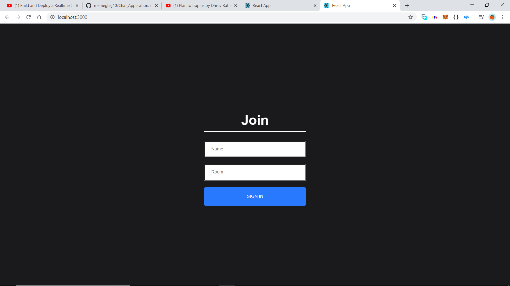
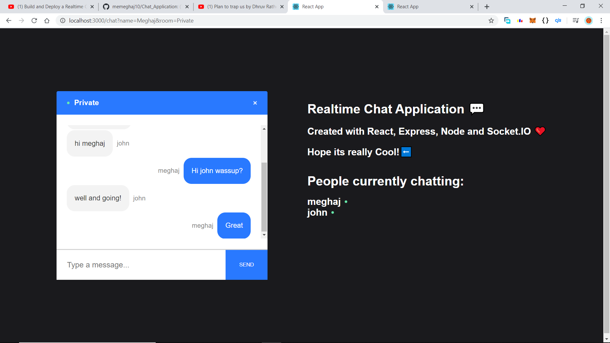
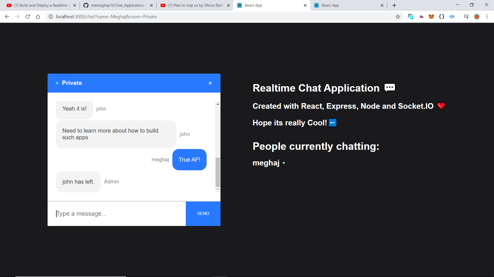

# Chat_Application

This is a simple Chat application created by me while trying to learn more about ReactJS and its applications with Web Sockets.

I have used the following functionalities:-

1. `ReactJs`.

2. `NodeJS`.

3. `SocketIO`.

4. `CORS`.

5. `ExpressJS`.

6. `Nodemon`.

The app-structure of this application has been divided into two 2 folders:-

1. Front-end: `Client`.

2. Back-End: `Server`.

The app serves the following functionalities :-

1. `Login` and `Exit` the ChatRoom.

2. The Creator of a new ChatRoom becomes the `admin`.

3. The `emoji` option is although yet to be enabled, but the keybords sign can be used.

4. `End-to-End` chat messages delivery.

Although I learned quite a lot while trying to build this app, but further improvements are yet to be made:-

1. Adding `Phtotos and Media Files` by a user to the ChatRoom.

2. Provision of the `Admin Rights` to the Room-Admin.

3. `Deployment of the app on Heroku/Netlify/MongoDB-Atlas`.

## This is the landing-page.

## This is the screen-shot inside the room.

## This is the screen-shot when a user leaves.

